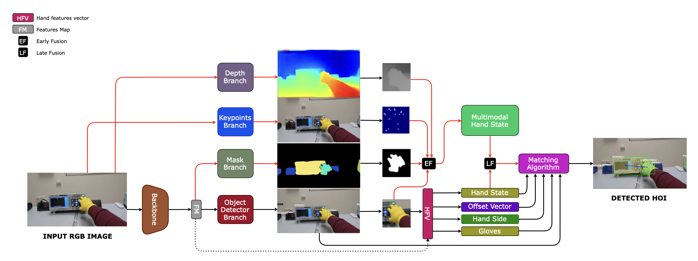
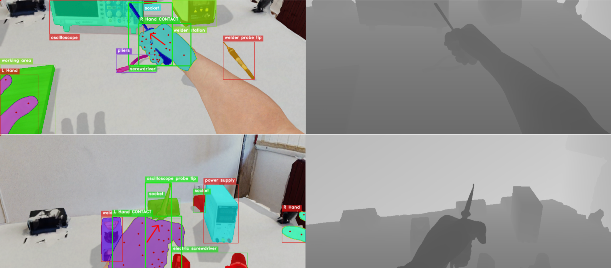
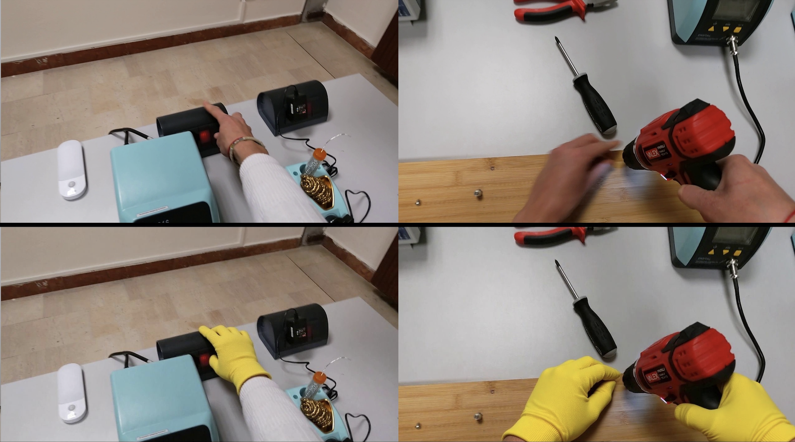

# GlovEgo-Net

This repository provides the official implementation of the paper:

**GlovEgo-HOI: Bridging the Synthetic-to-Real Gap for Industrial Egocentric Human-Object Interaction Detection**  
(*VISAPP @ VISIGRAPP 2026*)

Project Website: [https://nextvisionlab.github.io/GlovEgo-HOI/](https://nextvisionlab.github.io/GlovEgo-HOI/)  
Paper: [placeholder_link]

If you find **GlovEgo-Net** or the **GlovEgo-HOI** dataset useful for your research, please consider citing:

```bibtex
@inproceedings{spoto2026glovegonet,
  author    = {Alfio Spoto and Rosario Leonardi and Francesco Ragusa and Giovanni Maria Farinella},
  title     = {GlovEgo-Net: Leveraging Synthetic and Real-world Data for Industrial Egocentric Human-Object Interaction},
  booktitle = {Proceedings of the 21st International Joint Conference on Computer Vision, Imaging and Computer Graphics Theory and Applications (VISIGRAPP) - Volume 4: VISAPP},
  year      = {2026},
  publisher = {SCITEPRESS}
}
```

---

## Overview

**GlovEgo-Net** is a multi-modal detection framework for **Egocentric Human-Object Interaction (EHOI)** in industrial environments.  
The system is designed to effectively bridge the **synthetic-to-real domain gap** by combining large-scale photorealistic synthetic data with augmented real-world imagery.

The approach explicitly models:
- Hand-object interactions
- Contact states
- Hand pose (21 keypoints)
- Personal Protective Equipment (PPE), with a focus on work gloves



---

## GlovEgo-HOI Dataset

**GlovEgo-HOI** is a benchmark dataset for industrial EHOI detection, composed of two complementary subsets that integrate synthetic and real data.

### Dataset Composition

| GlovEgo-HOI-Synth | GlovEgo-HOI-Real |
| :---------------: | :--------------: |
|  |  |
| Synthetic data generated via Unity Perception | Real images augmented via FLUX.1 Diffusion |

### Key Features

- **GlovEgo-HOI-Synth**
  - Generated by extending the Unity pipeline proposed in *Leonardi et al.*
  - Automatic annotations for:
    - **21 hand keypoints** (MediaPipe format)
    - **Depth maps**, **segmentation masks**, and **offset vectors**
  - Automatic **PPE simulation** (yellow work gloves on 50% of instances)
  - Native Unity SOLO annotations convertible to COCO format via  
    [Unity SOLO → COCO Converter](git@github.com:NextVisionLab/HOIE-solo2coco.git)

- **GlovEgo-HOI-Real**
  - Based on the EgoISM-HOI dataset
  - Augmented with realistic work gloves using **FLUX.1-Kontext-dev**
  - Structural consistency enforced using **SSIM > 0.95**

### Dataset Statistics

| Subset            | #Images | #Hands | #EHOIs | % PPE (Gloves) |
| ----------------- | ------: | -----: | -----: | -------------: |
| GlovEgo-HOI-Synth | 12,790  | 20,314 | 10,386 | 50.32%        |
| GlovEgo-HOI-Real  | 15,948  | 24,158 | 16,532 | 17.68%        |
| **Total**         | 28,738  | 44,472 | 26,918 | 32.14%        |

## Download

The **GlovEgo-HOI** dataset is available for download at the following links:

- [GlovEgo-HOI](placeholder_link) (15.4 GB)

Please refer to the [Dataset Composition](#dataset-composition) section for details on the subsets.
---

## Installation

### Prerequisites

- Python 3.9
- PyTorch ≥ 1.9.0

### Environment Setup

```bash
conda create --name glovego_hoi python=3.9
conda activate glovego_hoi
pip install -r requirements.txt
```

---

## Model Zoo

Pre-trained weights for all experiments reported in the paper are provided.  
Download the desired files and place them in the `./weights/` directory.

### 1. Sim-to-Real Scaling (Synth → Real)

| Model ID        | Real Data % | Keypoint Head | mAP Hand+ALL | Weights |
|-----------------|-------------|---------------|--------------|---------|
| glovego_ft_10   | 10%         | ✓             | 12.34        | [Download](placeholder_link) |
| glovego_ft_25   | 25%         | ✓             | 13.10        | [Download](placeholder_link) |
| glovego_ft_50   | 50%         | ✓             | 14.45        | [Download](placeholder_link) |
| glovego_net     | 100%        | ✓             | **19.06**    | [Download](placeholder_link) |

> `ft`: fine-tuned on real data after synthetic pre-training

### 2. Real-Only Baselines

| Model ID        | Real Data % | Keypoint Head | mAP Hand+ALL | Weights |
|-----------------|-------------|---------------|--------------|---------|
| glovego_ro_10   | 10%         | ✗             | 12.07        | [Download](placeholder_link) |
| glovego_ro_25   | 25%         | ✗             | 12.00        | [Download](placeholder_link) |
| glovego_ro_50   | 50%         | ✗             | 11.84        | [Download](placeholder_link) |
| glovego_ro_100  | 100%        | ✗             | **18.12**    | [Download](placeholder_link) |

> `ro`: trained only on real data

### 3. Synthetic-Only & Ablation

| Model ID             | Architecture        | Modalities              | mAP (Real) | Weights |
|----------------------|---------------------|--------------------------|------------|---------|
| glovego_so_no_kpts   | GlovEgo-Net w/o Kpts| RGB                      | 5.44       | [Download](placeholder_link) |
| glovego_so           | GlovEgo-Net         | RGB+Depth+Mask+Kpts      | **6.22**   | [Download](placeholder_link) |

---

## Usage

### Training

Ensure backbone weights are available at:

```
./weights/faster_rcnn_R_101_FPN_3x_midas_v21-f6b98070.pth
```

#### Synthetic Pre-training

```bash
python train.py \
  --train_json ./data/annotations/synth_train.json \
  --test_json ./data/annotations/synth_val.json \
  --weights_path ./weights/faster_rcnn_R_101_FPN_3x_midas_v21-f6b98070.pth \
  --mask_gt --keypoints_gt --gloves_gt
```

#### Sim-to-Real Fine-tuning

```bash
python train.py \
  --train_json ./data/annotations/real_train_10.json \
  --test_json ./data/annotations/real_val.json \
  --weights_path ./checkpoints/synth_pretrained.pth \
  --freeze_modules backbone depth_module _mask_rcnn_head \
  --gloves_gt
```

### Evaluation

```bash
python test.py \
  --dataset_json ./data/annotations/real_test.json \
  --dataset_images ./data/images/real_test/ \
  --weights_path ./checkpoints/model_final.pth
```

### Inference

```bash
python inference.py \
  --images_path ./data/sample_input \
  --weights_path ./checkpoints/model_final.pth \
  --cfg_path ./checkpoints/cfg.yaml \
  --save_dir ./output/inference_results
```

---

## Experiment Tracking

The project integrates **Weights & Biases** for experiment tracking.

```bash
wandb sync wandb/latest-run/
```

---

## Acknowledgements

This research has been supported by **Next Vision s.r.l.** and by the project  
**Future Artificial Intelligence Research (FAIR)** – PNRR MUR Cod. PE0000013 – CUP: E63C22001940006.
